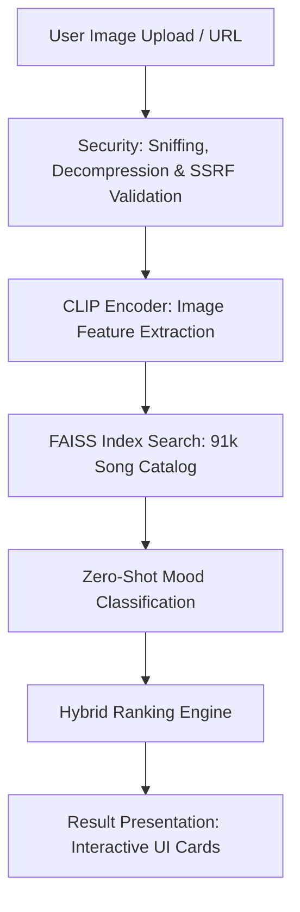

# PictoMusic 2.0 — AI-Powered Image-to-Song Discovery

PictoMusic is an intelligent visual recommendation system that turns images and photos into tailored musical soundtracks. It is engineered with a special focus on Indian regional music, Bollywood charts, and multilingual moods, querying a massive catalog of **91,000+ tracks**.

---

## 🚀 Key Features

* **Image-to-Song Discovery**: Upload any photo or input a URL to discover matching songs based on visual content and inferred mood.
* **Pan-Indian Soundtrack Focus**: Tuned to prioritize Hindi/Bollywood, Tamil, Telugu, Punjabi, Marathi, Gujarati, Bengali, Bhojpuri, Devotional, and classical Indian genres.
* **Hybrid Ranking & Boosting**: Custom-ranking algorithm that balances semantic similarity, artist popularity, release year, language/region metadata, and track preview availability.
* **Zero-Shot Mood Classification**: Leverages CLIP to analyze the emotional context of images (e.g., *sunset and golden hour* ➡️ *romantic/warm/soothing* soundtrack).
* **Hardened Security**: Includes upload MIME-type sniffing, decompression bomb protection, rate limiting, and Server-Side Request Forgery (SSRF) filters.

---

## 🛠️ Architecture Overview



1. **Feature Extraction**: Extracts visual embeddings from your image using OpenAI's `CLIP-ViT-Base-Patch32`.
2. **Catalog Indexing**: Uses a high-performance FAISS index matching CLIP space against the 91,000+ song catalog.
3. **Zero-Shot Mood Classification**: Infers dominant moods (e.g., energetic, melancholic, serene, devotional) from the image using zero-shot CLIP keywords.
4. **Hybrid Ranking**: Balances visual relevance with language preference, region relevance, track freshness, popularity, and unique deduplication filters.
5. **Interactive UI**: Custom Streamlit layout styled using a curated, premium-feel dark theme with HTML/CSS audio players and external service links.

---

## 📦 Setup & Installation

### Prerequisites

* Python 3.11+ (Tested up to Python 3.14.3)
* [uv](https://github.com/astral-sh/uv) (Recommended) or standard `pip`

### 1. Clone & Install Dependencies

```bash
# Install dependencies
pip install -r requirements.txt
pip install -r requirements-dev.txt
```

### 2. Configure Environment

Copy `.env.example` to `.env` and adjust weights or security parameters as needed:

```bash
cp .env.example .env
```

### 3. Run the Streamlit Application

```bash
streamlit run src/app.py
```

---

## 🧪 Quality Gates & Testing

We maintain rigorous testing suites to prevent recommendations and security regressions.

### Unit & Integration Tests

Run the standard pytest suite:

```bash
python -m pytest
```

### Golden Quality Checks

Validate recommendation quality, diversity, preview shares, and India-first retrieval metrics against deterministic golden tests:

```bash
python -m src.evaluation
```

The evaluation suite verifies:
* Real catalog coverage for Bollywood, Tamil, Punjabi, Marathi, Gujarati, Bengali, devotional, and Bhojpuri scenarios.
* Preview-first result balancing while preserving strong matches.
* Suppressed duplicates so the recommendations are diverse.

### Fine-Tuning & Embedding Safety

See [`docs/recommender_finetuning_plan.md`](docs/recommender_finetuning_plan.md) for the staged plan to improve recommendations without breaking the current 91K-song retrieval system.

The current safe enhancement is embedding cache provenance: generated embeddings can be paired with `song_embeddings_fp16.npy.manifest.json`, which records the active CLIP model, embedding shape, dataset size, and song-description fingerprint. Set `PICTOMUSIC_STRICT_EMBEDDING_MANIFEST=1` after the manifest is present to prevent stale embeddings from being reused after a model, dataset, or description-schema change.

---

## 🐳 Docker Deployment (Hugging Face Spaces)

This repository is optimized for deployment as a Docker SDK space on Hugging Face.

### Build and Run Locally:

```bash
docker build -t pictomusic .
docker run -p 7860:7860 pictomusic
```
