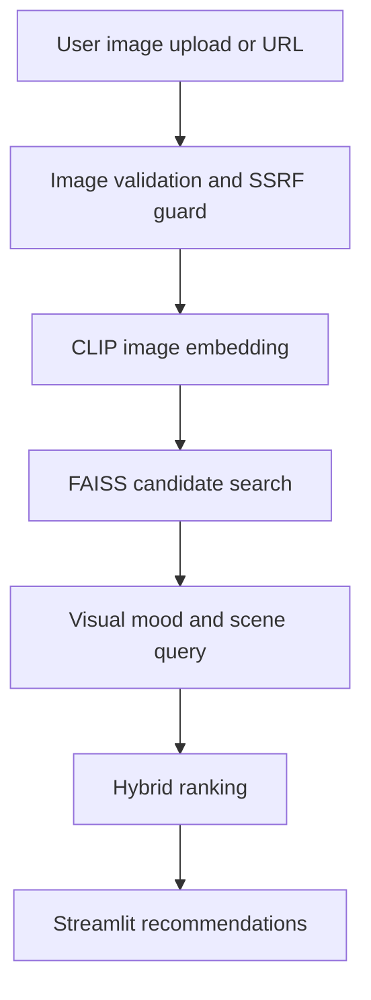

# PictoMusic 2.0

PictoMusic turns an image into a ranked music set using CLIP embeddings, FAISS retrieval, and hybrid ranking tuned for Indian languages, regions, moods, previews, and recent catalog signals.

The production Space is configured as a Hugging Face Docker Space. The app listens on port `7860`, uses `src/app.py` as the Streamlit entrypoint, and expects `Music.csv`, `song_embeddings_fp16.npy`, and `song_embeddings_fp16.npy.manifest.json` to be present in the repository.

## Core Flow



## Features

- Image-to-song discovery from uploads or image URLs.
- India-first retrieval across Hindi, Tamil, Telugu, Punjabi, Bengali, Marathi, Gujarati, Bhojpuri, devotional, and related catalogs.
- CLIP plus FAISS retrieval over a 91K+ song corpus.
- Hybrid scoring for visual similarity, mood relevance, language, region, recency, popularity, previews, artwork, and result diversity.
- Hardened upload and URL handling with MIME sniffing, byte limits, decompression-bomb limits, rate limiting, and SSRF filtering.
- Embedding manifest validation to prevent stale song vectors after dataset or description changes.

## Local Setup

```bash
pip install -r requirements.txt
pip install -r requirements-dev.txt
streamlit run src/app.py
```

## Quality Gates

Run the full test suite:

```bash
python -m pytest
```

Run deterministic recommendation quality checks:

```bash
python -m src.evaluation
```

Run the same checks with an optional offline RL / contextual-bandit log:

```bash
python -m src.evaluation --interaction-log path\to\interactions.csv
```

The interaction log can include `action`, optional `reward`, and optional
`propensity` / `target_propensity` columns. When propensities are present, the
evaluator reports IPS and self-normalized IPS estimates for a target policy.
Without propensities, it reports logged average reward only.

Run the Hugging Face deployment readiness gate:

```bash
python scripts/verify_hf_deployment.py
```

The deployment readiness gate verifies:

- Hugging Face Space metadata uses `sdk: docker` and `app_port: 7860`.
- Dockerfile exposes and serves port `7860` as user `1000`.
- Required runtime dependencies are present.
- `Music.csv`, `song_embeddings_fp16.npy`, and the manifest are valid and aligned.
- Large CSV/NPY artifacts are tracked through Git LFS attributes.

## Hugging Face Docker Deployment

Build and run locally with the same public port used by Spaces:

```bash
docker build -t pictomusic .
docker run --rm -p 7860:7860 pictomusic
```

Then open:

```text
http://localhost:7860
```

Before pushing to the Space remote, run:

```bash
python -m pytest
python -m src.evaluation
python scripts/verify_hf_deployment.py
git lfs status
```

Current Space remote:

```bash
git remote -v
```

The expected Hugging Face remote in this checkout is:

```text
https://huggingface.co/spaces/fxsab/pictomusicU
```

For Brave, share the direct Space app URL when possible:

```text
https://fxsab-pictomusicu.hf.space
```

The Hugging Face repository page embeds the app in an iframe, and Brave Shields can block embedded resources or camera access in that wrapper.

## Embedding Cache

The current cache is generated with `openai/clip-vit-base-patch32` and stored as `song_embeddings_fp16.npy`. The companion manifest records:

- dataset row count
- embedding shape
- embedding dtype
- CLIP model name
- text fingerprint for the song descriptions

Set strict loading in deployment when the manifest is present:

```bash
PICTOMUSIC_STRICT_EMBEDDING_MANIFEST=1
```

## Fine-Tuning Plan

See [docs/recommender_finetuning_plan.md](docs/recommender_finetuning_plan.md) for staged improvements to retrieval quality without breaking the current 91K-song system.

## 📖 How to Use & User Guide

### 1. Navigating the UI
* **Desktop View:** The interface is divided into two main panels: the **Image Desk** (left column for uploading images, selecting parameters, and starting analysis) and the **Output Desk** (right column for results, statistics, and playback).
* **Mobile View:** On mobile screens, the layout automatically stacks vertically. The **Image Desk** is displayed at the top, and the **Output Desk** renders directly below it. 
  * *Note:* The sidebar containing listening filters is collapsed by default on mobile. Tap the small dark arrow button (`>`) at the top left of the screen to expand it, adjust settings, and collapse it (`<`) to return to the main dashboard.

### 2. Choosing a Visual Input
You can provide an image in one of three ways:
1. **Gallery Upload:** Select "Gallery" under the "Upload Image" option and browse or drag a file. We accept PNG, JPG, WEBP, and HEIC/HEIF files (common on mobile phones, which are automatically normalized to JPEG).
2. **Camera Input:** Switch to the "Camera" tab to capture a live photo directly using your phone or web camera.
3. **Image URL:** Switch to the "Image URL" tab and paste any public URL pointing directly to an image. Tap "Use sample image" to quickly run a test with our demo picture.

### 3. Tuning the Recommendations (Sidebar)
Before clicking **"Analyze image"**, open the sidebar to customize your music set:
* **Language:** Match your image to a specific language (e.g. Hindi, Tamil, Telugu, Punjabi, Bengali, Marathi, Gujarati, Odia, Bhojpuri, Haryanvi) or choose **Any**.
* **Region:** Boost specific regional music styles (e.g. Bollywood, South Indian, Punjabi, Indie).
* **Release Recency:** Toggle "Prioritize newer releases" to prefer fresh tracks.
* **Audio Previews:** Toggle "Only songs with audio previews" to exclude tracks without playable audio clips.
* **Results Count:** Select how many tracks to generate (5 to 25).

### 4. Exploring the Output Set
After clicking **"Analyze image"**, the engine will process the visual tone, scene, and mood. The results appear in the **Output Desk**:
* **Match Confidence:** Shows how well the track matches your visual (Excellent, Strong, Good, or Possible match).
* **Match Reasons:** Displays badges explaining why the track matched (e.g. *Visual fit*, *Mood aligned*).
* **Playable Previews:** If a 30-second audio clip is available, you can play it directly in the browser.
* **Fallback Links:** If a preview is unavailable, quick links to search or open the track on **YouTube** and **Spotify** are rendered.

