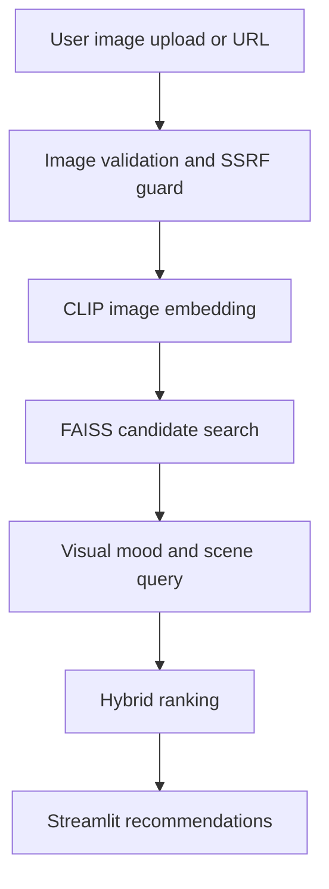

# PictoMusic 2.0

PictoMusic turns an image into a ranked music set using CLIP embeddings, FAISS retrieval, and hybrid ranking tuned for Indian languages, regions, moods, previews, and recent catalog signals.

The production Space is configured as a Hugging Face Docker Space. The app listens on port `7860`, uses `src/app.py` as the Streamlit entrypoint, and expects `Music.csv`, `song_embeddings_fp16.npy`, and `song_embeddings_fp16.npy.manifest.json` to be present in the repository.

## Core Flow



## Features

- Image-to-song discovery from uploads or image URLs.
- India-first retrieval across Hindi, Tamil, Telugu, Punjabi, Bengali, Marathi, Gujarati, Bhojpuri, devotional, and related catalogs.
- CLIP plus FAISS retrieval over a 91K+ song corpus.
- Hybrid scoring for visual similarity, mood relevance, language, region, recency, popularity, previews, artwork, and result diversity.
- Hardened upload and URL handling with MIME sniffing, byte limits, decompression-bomb limits, rate limiting, and SSRF filtering.
- Embedding manifest validation to prevent stale song vectors after dataset or description changes.

## Local Setup

```bash
pip install -r requirements.txt
pip install -r requirements-dev.txt
streamlit run src/app.py
```

## Quality Gates

Run the full test suite:

```bash
python -m pytest
```

Run deterministic recommendation quality checks:

```bash
python -m src.evaluation
```

Run the Hugging Face deployment readiness gate:

```bash
python scripts/verify_hf_deployment.py
```

The deployment readiness gate verifies:

- Hugging Face Space metadata uses `sdk: docker` and `app_port: 7860`.
- Dockerfile exposes and serves port `7860` as user `1000`.
- Required runtime dependencies are present.
- `Music.csv`, `song_embeddings_fp16.npy`, and the manifest are valid and aligned.
- Large CSV/NPY artifacts are tracked through Git LFS attributes.

## Hugging Face Docker Deployment

Build and run locally with the same public port used by Spaces:

```bash
docker build -t pictomusic .
docker run --rm -p 7860:7860 pictomusic
```

Then open:

```text
http://localhost:7860
```

Before pushing to the Space remote, run:

```bash
python -m pytest
python -m src.evaluation
python scripts/verify_hf_deployment.py
git lfs status
```

Current Space remote:

```bash
git remote -v
```

The expected Hugging Face remote in this checkout is:

```text
https://huggingface.co/spaces/fxsab/pictomusicU
```

## Embedding Cache

The current cache is generated with `openai/clip-vit-base-patch32` and stored as `song_embeddings_fp16.npy`. The companion manifest records:

- dataset row count
- embedding shape
- embedding dtype
- CLIP model name
- text fingerprint for the song descriptions

Set strict loading in deployment when the manifest is present:

```bash
PICTOMUSIC_STRICT_EMBEDDING_MANIFEST=1
```

## Fine-Tuning Plan

See [docs/recommender_finetuning_plan.md](docs/recommender_finetuning_plan.md) for staged improvements to retrieval quality without breaking the current 91K-song system.
